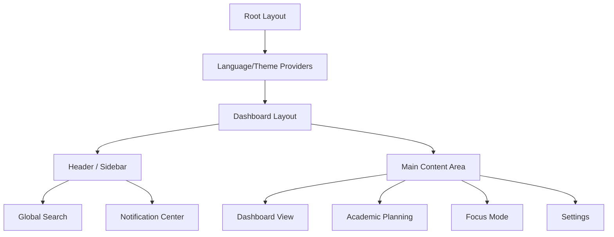

<div align="center">
  
  <h1>StudyFlow</h1>
  <p><b>The Ultimate Modern Academic Engine for Students</b></p>
  
  [](https://nextjs.org/)
  [](https://tailwindcss.com/)
  [](https://www.typescriptlang.org/)
  [](https://reactjs.org/)
</div>

---

## 🌟 Overview

**StudyFlow** is a comprehensive academic management platform designed to help students streamline their educational journey. From tracking semester plans and course progress to maintaining deep focus with a built-in Pomodoro engine, StudyFlow brings all your academic tools into one sleek, high-performance interface.

## 🚀 Key Features

### 📅 Academic Planning & Management
- **Semester Roadmap**: Visualize your entire degree timeline and track required credits.
- **Detailed Course Tracking**: Manage assignments, exams, and attendance for every course.
- **Dynamic GPA Calculation**: (Planned) Keep track of your academic standing in real-time.

### 🍅 Advanced Focus Mode
- **Custom Pomodoro Engine**: Tailor focus and break sessions to your personal learning style.
- **Daily Challenges**: Set time goals and track your focus progress with visual bars.
- **Integrated Tasks**: Manage session-specific tasks without leaving the focus environment.

### 🔍 Search & Discovery
- **Global Search**: Instantly find any course, task, or exam with `Cmd/Ctrl+K`.
- **Intelligent Categories**: Results are grouped logically for quick navigation.

### 🔔 Smart Notifications
- **Status Center**: Stay updated on upcoming deadlines and system notifications.
- **Persistent State**: Never miss a beat with a centralized notification hub.

## 🛠 Technical Stack

- **Core**: Next.js 16 (App Router), React 19
- **styling**: Tailwind CSS 4.0 (Modern utilities & performance)
- **UI Components**: Shadcn UI & Radix UI (Accessible & professional)
- **Icons**: Lucide React
- **Theming**: Dark/Light mode support via `next-themes`
- **State**: Centralized AppStore via React Context

## 🏗 Application Architecture



## 💻 Getting Started

### Prerequisites
- Node.js 20+
- npm / yarn / pnpm

### Installation

1. **Clone the repository**
   ```bash
   git clone https://github.com/your-username/studyflow.git
   cd studyflow
   ```

2. **Install dependencies**
   ```bash
   npm install
   ```

3. **Run the development server**
   ```bash
   npm run dev
   ```

4. **Build for production**
   ```bash
   npm run build
   npm start
   ```

## 🎨 UI Design Philosophy

StudyFlow utilizes a **premium, glassmorphic design** with:
- **HSL-tailored colors**: Harmonious and soft palette for long study sessions.
- **Micro-animations**: Smooth transitions and hover effects for a delightful UX.
- **Mobile First**: Fully responsive layout optimized for tablets and smartphones.

## 🛠 Backend Integration

If you are a backend developer looking to connect this frontend with **Laravel**, please refer to our detailed guides:

👉 **[Backend Integration Roadmap](backend_roadmap.md)** — *API Blueprints & Database Schema*

👉 **[Frontend Handover Guide](frontend_handover.md)** — *Architecture, Hooks & State Management*

---

<div align="center">
  <p>Built with ❤️ for students by <b>StudyFlow Team</b></p>
</div>
