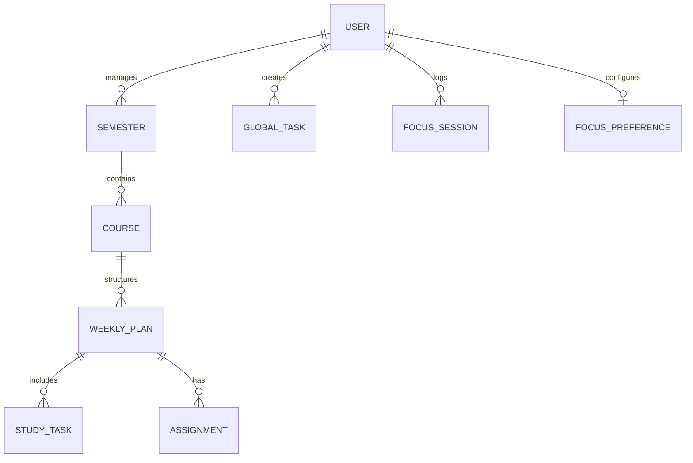

# 🚀 StudyFlow Backend Roadmap

Welcome to the **StudyFlow** project! This guide is designed to help you, the Laravel developer, build a robust and compatible backend for our Next.js frontend.

## 🏗 System Architecture
The application is a decoupled "Headless" app:
- **Frontend**: Next.js (TypeScript, Tailwind CSS)
- **Backend**: Laravel (RESTful API)
- **Communication**: JSON over HTTPS
- **Authentication**: Stateless (Laravel Sanctum Tokens)

---

## 🔐 1. Authentication & Security
We recommend using **Laravel Sanctum** for a simple and secure API token-based authentication.

### Key Steps:
1.  Install Sanctum: `composer require laravel/sanctum`
2.  Configure `CORS` in `config/cors.php`:
    ```php
    'paths' => ['api/*', 'sanctum/csrf-cookie'],
    'allowed_origins' => [env('FRONTEND_URL', 'http://localhost:3000')],
    'supports_credentials' => true,
    ```
3.  Implement standard auth routes:
    - `/api/register`
    - `/api/login`
    - `/api/logout` (requires `auth:sanctum`)
    - `/api/user` (profile data)

> [!IMPORTANT]
> The frontend expects a `Bearer` token in the `Authorization` header for all protected routes.

---

## 💾 2. Suggested Database Schema (ERD)
Here is the suggested entity structure to match the frontend components:



### Table Details:
- **Users**: Standard fields + `university`, `major`, `academicYear`, `currentGPA`.
- **Semesters**: `name`, `startDate`, `endDate`, `gpa`, `creditHours`.
- **Courses**: `title`, `code`, `instructor`, `credits`, `status (enum)`, `progress (int)`.
- **GlobalTasks**: `title`, `priority (low/medium/high)`, `type`, `status`, `dueDate`, `dueTime`.
- **FocusSessions**: `duration`, `startTime`, `endTime`, `mode (pomodoro/stopwatch)`.

---

## 🌐 3. API Blueprint (Endpoints)

| Feature | Method | Endpoint | Description |
| :--- | :--- | :--- | :--- |
| **Auth** | POST | `/auth/register` | Create new account |
| | POST | `/auth/login` | Return Bearer Token |
| | GET | `/auth/profile` | Current Auth User |
| **Planning** | GET | `/semesters` | List all user semesters |
| | POST | `/semesters` | Create new semester |
| | GET | `/semesters/{id}` | Detailed semester + courses |
| **Courses** | GET | `/courses` | List current user courses |
| | GET | `/courses/{id}` | Course details + weekly plans |
| | PATCH | `/courses/{id}` | Update progress/status |
| **Tasks** | GET | `/tasks` | Filterable list of tasks |
| | POST | `/tasks` | Create new task |
| | PATCH | `/tasks/{id}` | Toggle status (done/todo) |
| **Focus** | POST | `/focus/sessions` | Log a completed study session |
| | GET | `/focus/analytics` | Weekly/Monthly focus stats |

---

## 🧪 4. Expected JSON Data Formats

### Example: Course Details Response
```json
{
  "id": "c_123",
  "title": "Data Structures",
  "instructor": "Dr. Ahmed",
  "progress": 45,
  "weeklyPlan": [
    {
      "week": 1,
      "title": "Introduction to Linked Lists",
      "tasks": [
        { "id": "t1", "title": "Read Chapter 1", "completed": true }
      ],
      "assignments": [
        { "id": "a1", "title": "Homework 1", "status": "submitted" }
      ]
    }
  ]
}
```

---

## 🚀 5. Phased Roadmap for the Backend Developer

### **Phase 1: Foundation (Days 1-3)**
- Setup Laravel 11 project.
- Configure Database & Sanctum.
- Implement `/register`, `/login`, and `/profile`.

### **Phase 2: Academic Core (Days 4-7)**
- Create Migrations for Semesters & Courses.
- Implement CRUD for Academic Planning.
- Add "Setup" endpoint to save initial university info.

### **Phase 3: The Daily Grind (Days 8-12)**
- Implement Global Tasks management.
- Build Weekly Plans & Tasks logic for each course.
- Add Assignment tracking.

### **Phase 4: Advanced Features (Days 13-15)**
- Focus Session logging.
- Statistics & Analytics endpoints.
- Notifications (optional).

---

## 🛠 Useful Commands
- Migrate: `php artisan migrate`
- Create Controller: `php artisan make:controller Api/CourseController --api`
- Run Server: `php artisan serve`

> [!TIP]
> Use **Laravel Request Validation** to ensure the frontend always gets the data it expects. Stick to `PascalCase` or `camelCase` for JSON keys if possible to match the TypeScript interfaces.
